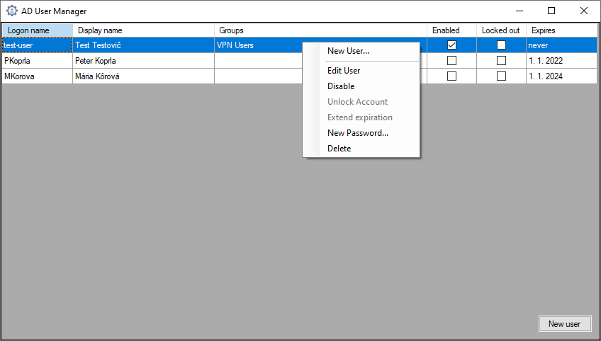

# AD User Manager

Simple C# WinForms app to manage Active Directory Users and Groups.

Supports following operations:
 - creating new accounts
 - disabling, enabling and unlocking accounts
 - changing and extending expiration
 - changing passwords
 - adding/removing users from groups

## Configuration
1. Create an OU for managed groups and users. Could be different OUs or one.
2. Delegate "create, delete and manage user accounts" and "Reset user passwords ..." on Users OU to a desired manager user, ideally a (non-managed) group.
3. Delegate "manage membership" on Groups OU to a desired manager user.

app configuration xml:
- dc_name: IP address or hostname of domain controller. If left empty, it will be discovered automatically.
- username: Authentication username. If left empty, current logged in user will be used
- password: Authentication password. Only used if username is provided.
- users_dn: DN of Users OU to be managed
  - example: `OU=Managed,OU=AD Users,DC=example,DC=com`
- groups_dn: DN of Groups OU to be managed
  - example: `OU=Managed,OU=Groups,DC=example,DC=com`
- managers_group_dn: DN of Managers Group. Used to determine whether current user has write access
 - example: `CN=UserAccountManagers,OU=Groups,DC=example,DC=com`
- logging_enabled: logging to local Windows EventLog
- expiration_enabled: expiration enabled or disabled by default for new accounts
- expiration_date: default/base expiration date. Multiple years or months are added to the date for it to be in the future. This date must be in the past.
- expiration_extend_period: period added to expiration date when being extended
 - example: `year`, `month`

# Attribution
Icon made by [Freepik](https://www.freepik.com)