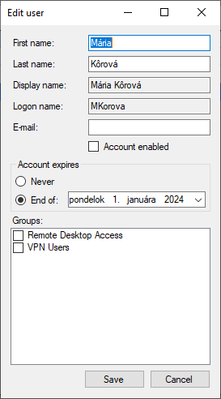

# AD User Manager

Simple C# WinForms app to manage Active Directory Users and Groups.

Supports following operations:
 - creating new accounts
 - disabling, enabling and unlocking accounts
 - changing passwords
 - adding/removing users from groups

## Configuration
1. Create an OU for managed groups and users. Could be different OUs or one.
2. Delegate "create, delete and manage user accounts" and "Reset user passwords ..." on Users OU to a desired manager user, ideally a (non-managed) group.
3. Delegate "manage membership" on Groups OU to a desired manager user.

app configuration xml:

- dc_name: IP address or hostname of domain controller. If left empty, it will be discovered automatically.
- username: Authentication username. If left empty, current logged in user will be used
- password: Authentication password. Only used if username is provided.
- users_dn: DN of Users OU
  - example: `OU=Managed,OU=AD Users,DC=example,DC=com`
- groups_dn: DN of Groups OU
  - example: `OU=Managed,OU=Groups,DC=example,DC=com`
- domain_name: domain part (suffix) of userPrincipalName for new users

# Attribution
Icon made by [Freepik](https://www.freepik.com)